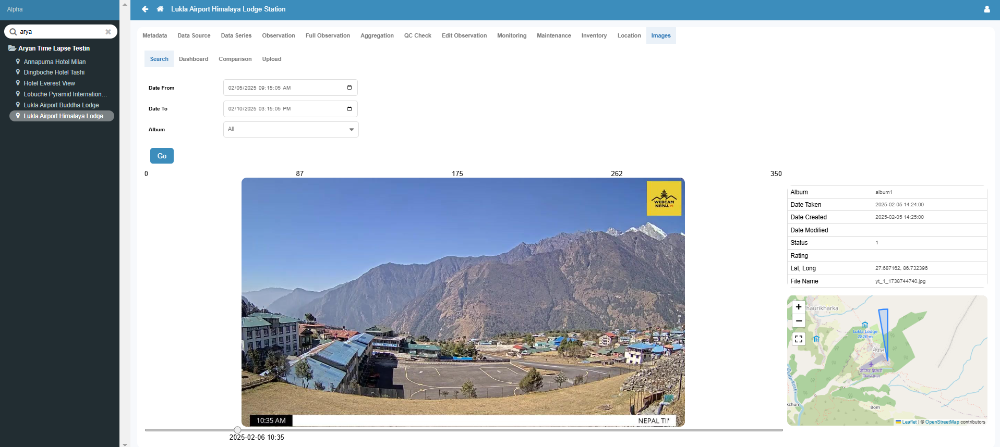
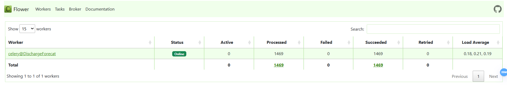
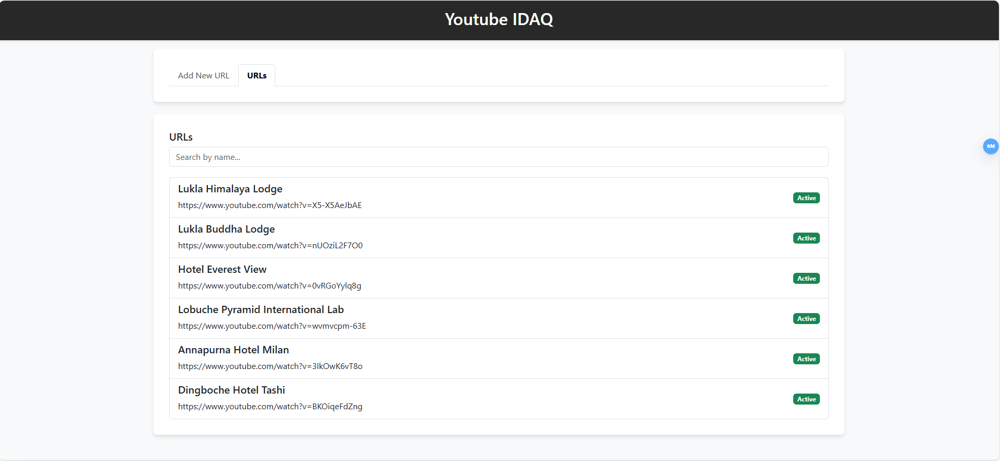

# YouTube Streams to RTS-TSS

A scalable system for monitoring and forecasting visibility conditions in Nepal's airport surroundings by leveraging YouTube live streams. This solution eliminates the need for expensive sensors and cameras.

**For Further Information refer the following Link:**
[YouTube Streams to RTS-TSS DOCS](https://docs.google.com/document/d/1OUCnrAf92U85wPd4-4Y8pCZPkgxiCdugUYKSglWepN8/edit?tab=t.0)







## Features

- **Real-time Image Capture**: Extracts images from YouTube streams at customizable intervals.
- **Dynamic Scheduling**: Define and manage capture schedules per URL.
- **Concurrent Processing**: Handles multiple streams efficiently.
- **Automated Image Processing**: Captures, enhances, and embeds metadata (GPS, altitude, timestamp).
- **Seamless API & Web UI**: Manage URLs, metadata, and view real-time streams.
- **Optimized Storage**: Uploads images to FTP NAS and deletes local copies post-upload.
- **Robust Backend**: Django with Celery, Celery Beat, and Redis for task management.

## System Architecture

- **Frontend**: Simple UI hosted on `192.168.0.159:8080`.
- **Backend**: Django-based API with Celery workers.
- **Database**: PostgreSQL for fast queries.
- **Broker**: Redis in no-append mode for efficiency.
- **Deployment**: Debian VM at `192.168.0.159`.
- **Time Zone**: UTC for timestamps.

## Installation & Setup

### Prerequisites
Ensure the following are installed:
- Python 3.8+
- PostgreSQL
- Redis

### Steps to Setup & Run

1. **Clone the Repo**
   Clone the repository to your local machine:
   ```bash
   git clone https://github.com/your-repo/youtube-streams-rts-tss.git
   cd youtube-streams-rts-tss
    

## 2. Install Dependencies
Install the required Python libraries listed in `requirements.txt`:
```bash
pip install -r requirements.txt
```

## 3. Configure Environment Variables
Create a `.env` file and add the following environment variables with your configuration:
```
LOCAL_DB_NAME=your_local_db_name
LOCAL_DB_USER=your_local_db_user
LOCAL_DB_PASS=your_local_db_pass
LOCAL_DB_HOST=your_local_db_host
LOCAL_DB_PORT=your_local_db_port

REDIS_URL=redis://localhost:{port}

#FTP Details
ftp_server = your_ftp_host
ftp_username = your_ftp_user
ftp_password = your_ftp_password
remote_dir=your_ftp_remote_dir
```

## 4. Apply Migrations
Set up the database by applying the migrations:
```bash
python manage.py makemigrations
python manage.py migrate
```

## 5. Start Services
Run the automated script to start all required services (Django, Celery workers, Celery Beat, and Redis):
```bash
python start_yt_idaq.py
```

## 6. Access the Interfaces
Once the services are running, you can access:
- Frontend UI: http://192.168.0.159:8080
- Django Admin: http://127.0.0.1:8000/admin/
- Celery Flower Dashboard: http://127.0.0.1:5555

## Usage
- **Add a YouTube Stream**: Use the frontend UI to input a YouTube stream URL.
- **Modify Metadata**: Update details like latitude, longitude, and altitude.
- **Enable/Disable Captures**: Start or stop image extraction for each stream.
- **Monitor Logs**: Check logs in the `logs/` directory for debugging.

## License
This project is licensed under the MIT License.

## Author
Aryan Manandhar

For any queries, mail at: aryanlivi@gmail.com


    